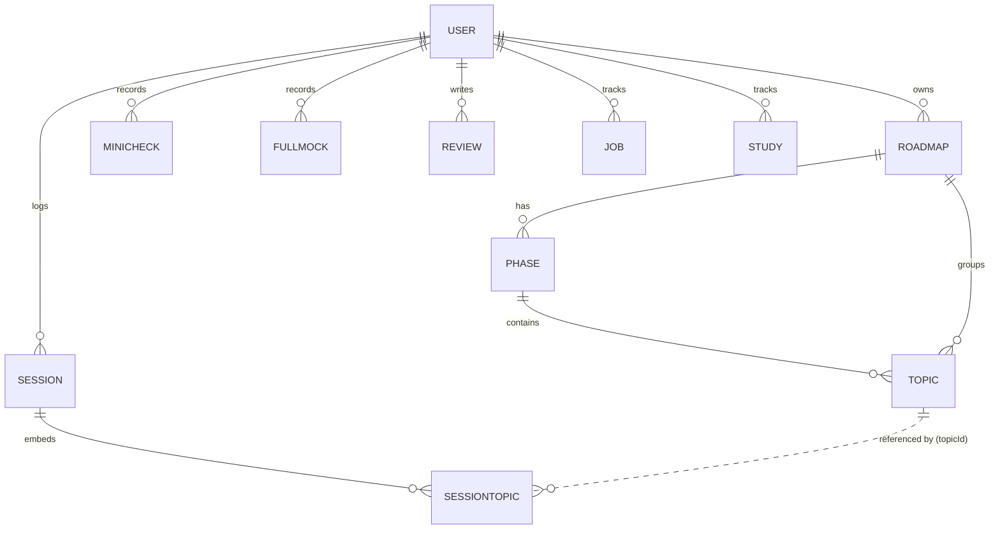

# Switchboard — Architecture & Implementation

Switchboard is a personal **job-switch / study-tracking** web app. It helps a single user
run a study roadmap session-by-session, track spaced-repetition revision, log weekly
reviews, record mock-interview results, and manage a job-application pipeline — all
anchored to real data rather than notes.

- **Frontend:** React 19 + TypeScript + Vite (SPA), plain CSS, dark theme.
- **Backend:** Node + Express REST API, MongoDB via Mongoose, JWT auth.
- **Charts & drag-and-drop:** hand-rolled (inline SVG + native HTML5 DnD) — **no chart or DnD libraries**, to stay dependency-light and avoid React 19 peer conflicts.

---

## 1. Repository layout

```
switchboard/
├── client/                     # React + Vite SPA
│   └── src/
│       ├── main.tsx            # Entry: StrictMode + AuthProvider + App
│       ├── App.tsx             # Router + route table
│       ├── api.ts              # apiFetch() + token helper
│       ├── index.css           # Global dark baseline (scrollbars, focus, fades)
│       ├── context/AuthContext.tsx
│       ├── components/         # Cross-feature UI (Sidebar, MainLayout, Modal, Funnel)
│       ├── features/           # Feature-scoped pieces (jobs/, study/, roadmap/, mocks/)
│       ├── pages/              # One component per route (+ its .css)
│       └── types/              # TS interfaces, re-exported from types/index.ts
│
├── server/                     # Express API
│   ├── server.js               # Bootstrap: middleware, CORS, route mounts
│   ├── models/                 # Mongoose schemas (one per collection)
│   ├── controllers/            # Request handlers (business logic)
│   ├── routes/                 # Express routers (one per resource)
│   ├── middleware/             # requireAuth, errorHandler
│   └── seed_full.js            # Reproducible demo-data seeder
│
└── docs/ARCHITECTURE.md        # This file
```

**Conventions**
- `pages/` = routed screens; `features/` = reusable pieces owned by one domain; `components/` = shared across domains.
- Every page co-locates its stylesheet (`Foo.tsx` + `Foo.css`); CSS is plain and globally scoped (class names are namespaced by hand).
- Types live in `types/*.ts` and are re-exported through `types/index.ts`, so app code imports from `../types`.

---

## 2. Backend architecture

### 2.1 Bootstrap & middleware order (`server/server.js`)

```
express.json()                 → parse JSON bodies
cors({ origin: [5173, 8080, CLIENT_URL] })
/auth   → authRoutes           (public: signup, login)
/jobs /study /roadmaps /phases /topics /sessions /mocks /reviews /dashboard
                               (each router calls requireAuth first)
errorHandler                   → last middleware
```

Every resource router except `/auth` begins with `router.use(requireAuth)`, so all data
endpoints are authenticated. `errorHandler` is mounted last and normalizes thrown errors.

### 2.2 Authentication

- **Model:** `User { email (unique), password }`.
- **Signup** (`POST /auth/signup`): validates, rejects duplicate email (409), bcrypt-hashes the
  password, stores the user, returns `201 { message }` — **no token**.
- **Login** (`POST /auth/login`): verifies with `bcrypt.compare`, signs a JWT
  `{ userId }` with `JWT_SECRET` (1-day expiry), returns `{ token }`.
- **`requireAuth`** middleware: expects `Authorization: Bearer <token>`, verifies it, sets
  `req.userId`, else `401`.
- **Client side:** the token is stored in `localStorage` and attached to every request by
  `apiFetch`. Because signup returns no token, the **Signup page auto-calls `/auth/login`**
  right after a successful signup so the new user lands authenticated.

> Every controller query is scoped by `userId: req.userId`, giving per-user data isolation.

### 2.3 Data model

All collections carry `userId` and (except `User`/`Study`) Mongoose `timestamps`.



| Collection | Key fields | Notes |
|---|---|---|
| **User** | `email` (unique), `password` (bcrypt) | |
| **Roadmap** | `name, goal, targetDate, isActive, status` | One active roadmap at a time; `createdAt` drives "weeks elapsed". |
| **Phase** | `roadmapId, name, startDate, endDate, order` | Ordered stages of a roadmap. |
| **Topic** | `phaseId, roadmapId, name, status, totalMinutes, lastStudiedAt, revisionCount` | `status`: `unscheduled \| scheduled \| completed`. Spaced-repetition state lives here. |
| **Session** | `date, slot, track, status, minutesSpent, notes, topics[]` | `slot`: `morning \| evening`; `track`: `dsa \| build \| other`; `status`: `planned \| completed \| skipped`. |
| **SessionTopic** (embedded) | `topicId, name, completed, minutesSpent` | A topic worked on within a session. |
| **MiniCheck** | `date, items[{topicId, topicName, kind, correct}]` | `kind`: `problem \| definition`. Frequent lightweight signals. |
| **FullMock** | `date, scores{dsa,concepts,complexity,architecture}, notes` | Full 90-min mock. |
| **Review** | `weekStart, weekEnd, body, stats{...}` | Weekly retro with auto-collected `stats`. |
| **Job** | `title, company, status, city, appliedDate, package, needsTailoredResume, …` | `status`: `applied \| interviewing \| offer \| rejected`. |
| **Study** | `subject, duration, topicsLeft, status` | Coarse per-subject study tracker (separate from roadmap Topics). |

### 2.4 Controller pattern

Controllers are thin and uniform: `find/findOne/…` scoped by `userId`, validate required
fields, return JSON, and `next(err)` to the error handler. Update handlers use an **allow-list**
of writable fields (e.g. `jobController.updateJob`) to prevent mass-assignment.

### 2.5 API reference

All routes below require `Authorization: Bearer <token>` except `/auth/*`.

| Method & path | Purpose |
|---|---|
| `POST /auth/signup` · `POST /auth/login` | Register / obtain JWT |
| `GET /dashboard` | **Aggregated** dashboard payload (see §2.6) |
| `GET/POST /roadmaps` · `GET/PATCH/DELETE /roadmaps/:id` | Roadmaps (delete archives if it has studied topics) |
| `GET/POST /phases` · `GET/PATCH/DELETE /phases/:id` | Phases |
| `GET /topics` · `GET /topics/unscheduled` · `GET/POST /topics` · `PATCH/DELETE /topics/:id` | Topics |
| `GET /topics/:id/sessions` | **Sessions containing this topic** (topic history) |
| `PATCH /topics/:id/revise` | **Spaced-repetition revise**: `revisionCount++`, `lastStudiedAt = now` |
| `GET /sessions?weekStart=ISO` | Sessions for a Mon–Sun week |
| `POST /sessions/bulk` | Bulk-create planned sessions |
| `PATCH /sessions/:id/complete` | Complete a session; rolls topic minutes/`lastStudiedAt` up to Topics |
| `PATCH/DELETE /sessions/:id` | Update / delete a session |
| `GET /mocks/trend` · `GET/POST /mocks/mini` · `GET/POST /mocks/full` · `DELETE /mocks/(mini\|full)/:id` | Mocks |
| `GET/POST /reviews` · `GET/PATCH/DELETE /reviews/:id` | Weekly reviews |
| `GET/POST /jobs` · `GET/PATCH/DELETE /jobs/:id` | Job applications |
| `GET/POST /study` · `GET/PATCH/DELETE /study/:id` | Study subjects |

> The two `/topics/:id/*` routes are declared **before** `/:id` in the router so Express
> matches `/sessions` and `/revise` rather than treating them as an id.

### 2.6 Dashboard aggregation & spaced repetition

`GET /dashboard` (`dashboardController.js`) runs several queries with `Promise.all` and returns:

- **`roadmap`** — active roadmap with `weeksElapsed`/`weeksRemaining` (from `createdAt`/`targetDate`),
  `overallCompletion` (0–1), and per-phase `{completion, status, behindSchedule}`.
  `behindSchedule` compares actual completion against expected progress
  (`elapsed / totalDuration`) with a 10% tolerance.
- **`todaysSessions`** — sessions dated today.
- **`momentum`** — `daysSinceLastApplication`, `currentStreak` (consecutive days with a completed
  session), `topicsOverdueCount`, `sessionsThisWeek {completed, planned}`.
- **`dueForRevision`** — studied topics past their spaced-repetition interval.

**Spaced-repetition schedule** (shared concept, computed server-side for the dashboard and
client-side on the Topic page):

```
intervals = [1, 3, 7, 14, 30]  // days
dueDate = lastStudiedAt + intervals[min(revisionCount, 4)]
```

Each successful **revise** bumps `revisionCount`, pushing the next due date further out.

### 2.7 Error handling

`middleware/errorHandler.js` maps Mongoose `CastError` → `400 Invalid id format`,
`ValidationError` → `400` with the message, and everything else → `500`.

---

## 3. Frontend architecture

### 3.1 Entry & providers (`main.tsx`)

`StrictMode → AuthProvider → App`. `AuthProvider` holds the JWT (seeded from
`localStorage`) and exposes `{ token, login, logout, isAuthenticated }`.

### 3.2 Routing (`App.tsx`)

```
/login, /signup                → public
<MainLayout> (auth guard)
  /            → Dashboard
  /roadmap     → Roadmap
  /planner     → Planner
  /jobs        → Jobs
  /study       → Study
  /mocks       → Mocks
  /reviews     → Reviews
  /topics/:id  → TopicDetail
```

`MainLayout` renders the `Sidebar` + `<Outlet/>` and redirects to `/login` when
`!isAuthenticated`. The sidebar lists all seven sections with inline-SVG icons plus Logout.

### 3.3 Data access (`api.ts`)

A single `apiFetch(path, options)` helper:
- Prefixes `VITE_API_URL` (default `http://localhost:3000`).
- Injects `Content-Type: application/json` and the `Bearer` token.
- Throws `Error(body.error || "Request failed : <status>")` on non-2xx, so callers use
  `try/catch` and surface `err.message`.

**Data-fetching pattern:** pages fetch in `useEffect` (often `Promise.all`), keep local
state, and use **optimistic updates with rollback** for mutations (e.g. Jobs status drag,
deletes, dashboard "Mark Revised") — the UI changes immediately and reverts if the request fails.

### 3.4 Shared components

- **`Modal`** — accessible dialog (Esc + backdrop close), `size="sm" | "lg"`. Used by every
  create/detail flow.
- **`Funnel`** — application pipeline (Applications → Responses → Interviews → Offers) with
  conversion %; shared by Dashboard and Jobs.
- **`Sidebar` / `MainLayout`** — app shell + auth guard.

### 3.5 Feature implementations

- **Jobs kanban (`features/jobs/`)** — four status columns via **native HTML5 drag-and-drop**
  (`dataTransfer` carries the job id; columns handle `dragover`/`drop`). Dropping a card
  optimistically moves it and PATCHes the new status. Includes the Add-Application modal and
  the funnel.
- **Mocks (`features/mocks/ScoreTrend.tsx` + `pages/Mocks.tsx`)** — a **hand-rolled inline-SVG**
  trend chart (full-mock average as a purple line, mini-checks as yellow dots), a latest-mock
  breakdown with deltas, and a per-topic table aggregated from mini-check items. The record
  modal toggles Mini/Full and posts to `/mocks/mini` or `/mocks/full`.
- **Planner (`pages/Planner.tsx`)** — weekly grid; a bulk-entry modal with per-row validation
  (empty / duplicate / already-occupied slot) that only surfaces **after a save attempt**, plus
  an unsaved-changes guard.
- **Roadmap (`pages/Roadmap.tsx`)** — a roadmap.sh-style **vertical track**: a spine of numbered
  phase nodes (done ✓ / in-progress / upcoming), progress bars, and an expandable topic-node
  grid where each topic links to its detail page.
- **TopicDetail (`pages/TopicDetail.tsx`)** — spaced-repetition status, stat tiles, a real
  "Mark Revised" action, and a **session-history timeline** from `/topics/:id/sessions`.
- **Reviews / Study / Dashboard** — card layouts with detail modals, an effort chart (Study),
  and the aggregated dashboard sections.

### 3.6 Styling

Plain, per-component CSS on a dark theme. Shared tokens (by convention, not variables):
near-black panels `#16131f`/`#14111d`, accent `#7c3aed`, subtle border `#2a2438`, text
`#e9e4f5`/muted `#8b849e`; status colors green=done, purple=current/planned, amber=behind,
red=negative. `index.css` provides the global baseline — dark background, smooth scrolling,
themed scrollbars, focus-visible rings, a per-route fade-in, and `prefers-reduced-motion`.

---

## 4. Running locally

**Prerequisites:** Node 20+, a MongoDB connection string.

**Server** (`server/.env` → `MONGODB_URI`, `JWT_SECRET`, optional `PORT`, `CLIENT_URL`):
```bash
cd server
npm install
npm run dev        # nodemon server.js  (or: node server.js)
```

**Client** (`client/.env` → optional `VITE_API_URL`, default `http://localhost:3000`):
```bash
cd client
npm install
npm run dev        # Vite dev server on :5173
npm run build      # tsc -b && vite build → dist/
```

**Seed demo data** (clears & repopulates every collection for the demo user):
```bash
cd server
node seed_full.js
```

The seed builds one roadmap (5 phases, ~42 structured topics), ~17 sessions with log-style
notes, 4 mini-checks, 2 full mocks, 2 weekly reviews, 6 jobs, and 7 study subjects, and
backdates the roadmap's `createdAt` (via the raw driver, since Mongoose makes `createdAt`
immutable) so "weeks elapsed" is realistic.

---

## 5. Known limitations & decisions

- **Single active roadmap** is assumed by the dashboard/roadmap views.
- **Study vs Topics are separate collections.** The Study "completion" bar is derived from
  `status` (not a real performance metric); the model has no performance field.
- **Job funnel definitions:** Responses = any non-`applied`; Interviews = `interviewing`+`offer`;
  Offers = `offer`.
- **Planner collision key** is `day + slot + track` (two different tracks may share a slot) —
  open to tightening to `day + slot`.
- **No unique index** on `Session {userId, date, slot}` — duplicate-slot protection is
  currently client-side only.
- **Auth hardening:** `apiFetch` doesn't auto-redirect on `401`; routes are guarded only by the
  `MainLayout` check.

## 6. Possible next steps

- Compound unique index on sessions; server-side redirect/refresh on `401`.
- Real performance metric for Study; a "revise" history log.
- Pagination/virtualization for long topic/session lists; tests around the dashboard aggregation
  and spaced-repetition math.
